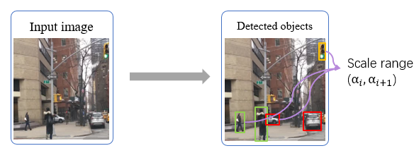
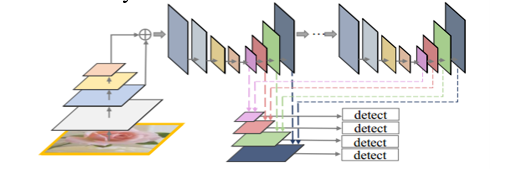
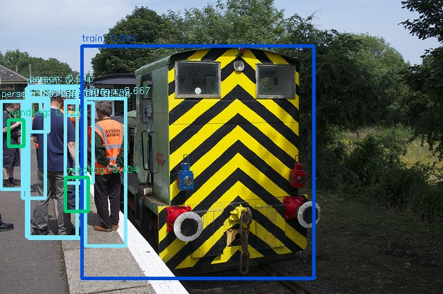
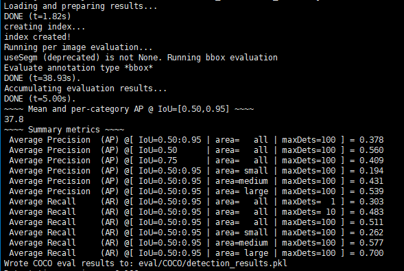

# M2Det
Codebase for AAAI2019 "M2Det: A Single-Shot Object Detector based on Multi-Level Feature Pyramid Network" [[Paper link]](https://qijiezhao.github.io/imgs/m2det.pdf)

Author: Qijie Zhao. Date: 19/01/2019

# Contents

* [Introduction](#Introduction)

* [Schedule](#Schedule)

* [Data Preparation and Installation](#Preparation)

* [Demo](#Demo)

* [Evaluation](#Evaluation)

* [Training](#Training)


  


## Introduction
### Motivation:
<div align=center>
<div align=left>
  
Beyond scale variation, **appearance-complexity variation** should be considered too for the object detection task, due to that the object instances with similar size can be quite different.


<div align=center>
<div align=left>
  
To solve this, we extend multi-scale detection fashions with a new dimension: **multi-level**. Deeper level learns features for objects with more appearance-complexity variation(e.g., pedestrian), while shallower level learns features for more simplistic objects(e.g., traffic light).

1, We propose **Multi Level FPN**:

<div align=center>
<div align=left>
  
2, Based on MLFPN, we propose a single-shot object detector: **M2Det**, which represents the **M**ulti-Level **M**ulti-Scale **Det**ector.

<div align=center>
<div align=left>


<div align=left>

### Methodology:


##### a. Construct the base feature:

We use the output of FFMv1(Feature Fusion Module v1) to construct the base feature. The size is fixed as (c=768, w=W/8, h=H/8), in which (W,H) denote the image's input size. While the input feature of FFMv1 is a shallower feature(the size is (W/4, H/4),to keep more details) and a deeper feature(the size is (W/8,H/8),to represent more semantics). For VGG16-reduced backbone, they are conv4-3 and conv6-2(maybe the names are different). While for ResNet series, we first set the striding of Res4 from 2 to 1, then we choose the output of Res3 and Res5 as the input of FFMv1, of course we can also choose the output of Res4 and Res5.

<div align=center>
<div align=left>

##### b. The Multi-level Multi-scale feature:
Given the base feature, we start to form the M2F. For each TUM(Thinned U-shaped Module), we use a leach layer(actually, it's a 1x1 conv layer to extract a thinner feature from the base feature, it's in the FFMv2) to get the feature from base feature, and concat it with the output of the last TUM as the input of TUM. At last, aggregate the pyramidal features from all levels with similar scales.

<div align=center>
<div align=center>
<div align=left>

##### c. Scale-wise Feature Aggregation Module:
We get the multi-level multi-scale feature, and try to re-allocate a weight for them to force the feature focusing more on the most useful channels/levels. Depending on the compress ratios, we use a SE attention module for each scale feature to learn attention along channel dimension.


<div align=center>

<div align=left>

## Schedule

<ul>
<li><input type="checkbox" disabled checked> 13 Nov, 2018 - Release the paper</li>
<li><input type="checkbox" disabled checked> 1 Mar, 2019 - Release the training, evaluation,  multi-scale evaluation and inference demo code + provide a pretrained model</li>
<li><input type="checkbox" disabled> 1 Apr, 2019 - Release most of the pretrained models</li>
</ul>


## Preparation
**the supported version is pytorch-0.4.1**

- Prepare python environment using [Anaconda3](https://www.anaconda.com/download/).
- Install deeplearning framework, i.e., pytorch, torchvision and other libs.

```Shell
conda install pytorch==0.4.1 torchvision -c pytorch
pip install opencv-python tqdm
```
- Clone this repository.
```Shell
git clone https://github.com/qijiezhao/M2Det.git
```
- Compile the nms and coco tools:

```Shell
sh make.sh
```

- Prepare dataset (e.g., VOC, COCO), refer to [ssd.pytorch](https://github.com/amdegroot/ssd.pytorch) for detailed instructions.


## Demo

**We provide a M2Det512_vgg pretrained model for demonstration(visualization):**

First, download the pretrained m2det512_vgg.pth([baidu cloud](https://pan.baidu.com/s/1LDkpsQfpaGq_LECQItxRFQ),[google drive](https://drive.google.com/file/d/1NM1UDdZnwHwiNDxhcP-nndaWj24m-90L/view?usp=sharing)) file. Then, move the file to weights/.

```Shell
  python demo.py -c=configs/m2det512_vgg.py -m=weights/m2det512_vgg.pth --show
```
You can see the image with drawed boxes as:


<div align=center>

<div align=left>

You can also run real-time demo using your webcam by specifying the camera's device ID with option `--cam`.
```Shell
  python demo.py -c=configs/m2det512_vgg.py -m=weights/m2det512_vgg.pth --show --cam=0
```

**In addition, I really suggest you to change the nms type from soft-nms to hard-nms for faster visualization. Soft-NMS is good for mAP accuracy, but it's useless for Demo/Vis.**

Thanks for the volunteer demonstration of m2det: [entry1](https://www.youtube.com/watch?v=VF8JuQwKQmU), [entry2](https://www.youtube.com/watch?v=1hugYRnLTHM), [entry3](https://www.youtube.com/watch?v=sYkqcTImK9w).
## Evaluation

1, **We provide evaluation script for M2Det:**
```Shell
  python test.py -c=configs/m2det512_vgg.py -m=weights/m2det512_vgg.pth
```
Then, the evaluated result is shown as:

<div align=center>

<div align=left>

 Even higher than our paper's original result! :)

**2, You can run the test set with M2Det and submit to get a score:**
```Shell
  python test.py -c=configs/m2det512_vgg.py -m=weights/m2det512_vgg.pth --test
```
and submit the result file to [CODALAB webpage](https://competitions.codalab.org/competitions/5181#participate).

## Training

As simple as [demo](#Demo) and [evaluation](#Evaluation), Just use the train script:
```Shell
  CUDA_VISIBLE_DEVICES=0,1,2,3 python train.py -c=configs/m2det512_vgg.py --ngpu 4 -t True
```
All training configs and model configs are written well in configs/*.py.

## Multi-scale Evaluation
To be added.

## Pre-trained Files
Now, we only provide m2det512_vgg.pth([baidu cloud](https://pan.baidu.com/s/1LDkpsQfpaGq_LECQItxRFQ),[google drive](https://drive.google.com/file/d/1NM1UDdZnwHwiNDxhcP-nndaWj24m-90L/view?usp=sharing)) due to we have other tasks recently, we decide to release other models in the future.

## Others

### Citation:

Please cite the following paper if you feel M2Det useful to your research

```
@inproceedings{M2Det2019aaai,
  author    = {Qijie Zhao and
               Tao Sheng and
               Yongtao Wang and
               Zhi Tang and
               Ying Chen and
               Ling Cai and
               Haibing Lin},
  title     = {M2Det: A Single-Shot Object Detector based on Multi-Level Feature Pyramid Network},
  booktitle   = {The Thirty-Third AAAI Conference on Artificial Intelligence,AAAI},
  year      = {2019},
}
```


## Contact
For any question, please file an issue or contact
```
Qijie Zhao: zhaoqijie@pku.edu.cn
```
